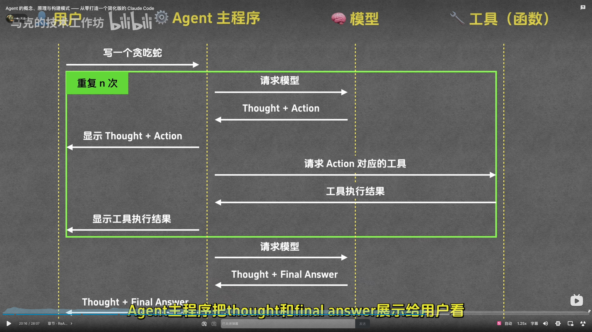

<!-- more -->
# Agent 开发

## Agent 开发

### Agent 工作+流程

> 参考【[Agent 的概念、原理与构建模式 —— 从零打造一个简化版的 Claude Code](https://www.bilibili.com/video/BV1TSg7zuEqR/?share_source=copy_web&vd_source=375a7ff5b8969717e38fb2edcfb7765a)】

ReAct：Reasoning + Acting（推理 + 行动）

Plan and Execute：先规划再执行

