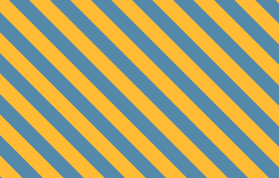
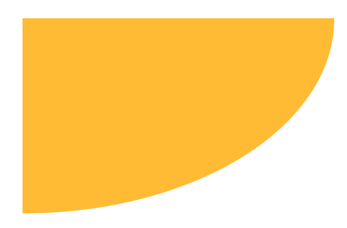

<!-- more -->

## 前言

在前端日常开发，大多数的样式都能写出来，不管是切图还是多套几层div，最终都能实现，所以对样式这一块的代码的简洁与优雅往往不太在意。《CSS揭秘》这本书通过各种各样的例子，由浅入深的讲解了如何用CSS实现各种炫酷效果、布局技巧以及介绍了一些不太常用却很实用的属性。本文就简单介绍下一些小TIPS和案例，更多内容推荐看下原书，微信读书内便有

## 小知识

### CSS 3包含的内容以及名字由来

CSS3 并没有在任何规范中定义过，指的是一个非正式的集合，CSS 2后，CSS工作组意识到语言已经变得非常庞大，无法塞进单个规范中，将CSS打散到不通模块中，它包括CSS规范第三版（延续CSS2.1已有特性的模块）再加上一些版本号还是1的新规范，如：

- CSS层叠与继承（http://w3.org/TR/css-cascade-3）
- CSS颜色（http://w3.org/TR/css3-color）
- CSS变形（http://w3.org/TR/css-transforms-1）

...


### 实现实验性的特性方案

CSS 迭代过程中，浏览器厂商为了实现一些实验性特性，出现过以下方案

- **[浏览器前缀](https://developer.mozilla.org/zh-CN/docs/Glossary/Vendor_Prefix)**：在名称前面加上自己特有的前缀。最常见的前缀分别是Firefox的-moz-、IE的-ms-、Opera的-o-以及Safari和Chrome的-webkit-。
- **通过配置开关启用**。有效防止开发者在生产环境中滥用。也是目前的趋势


## 实用技巧

**currentColor**

表示元素的 color 属性的值，比如想让所有的水平分割线（所有`<hr>`元素）自动与文本的颜色保持一致

currentColor本身就是很多CSS颜色属性的初始值，比如border-color和outline-color，以及text-shadow和box-shadow的颜色

```css
div{
  border-color: currentColor;
}
```

**继承：inherit**

绑定到父元素的计算值（对伪元素来说，则会取生成该伪元素的宿主元素）

比如：创建提示框的时候，你可能希望它的小箭头能够自动继承背景和边框的样式


```css
div{
  border-color: inherit;
}
```

**控制tab键长度**

比如展示代码时，想控制tab键的宽度，使用`tab-size`属性

```css
div{
  tab-size: 2;
}
```

## 示例

试着实现下面的功能，未特殊说明的情况下，以下示例只能使用一个元素（伪元素不在限制内）、不可使用图片

### 背景与边框

#### 1. 实现纯色背景 + 半透明边框 


- [官方示例](https://dabblet.com/gist/012289cc14106a1bd7a5)

<details>
<summary>
提示：
</summary>

使用background-clip

</details>

#### 2. 实现多重边框


- [官方示例](http://dabblet.com/gist/525eb8e9cdade71723c1)

<!-- 本地：./css-secrets/multi-border.html -->

<details>
<summary>
提示：
</summary>
<pre>
使用 box-shadow 或 outline。
注意：box-shadow 阴影本身不占空间，需要设置多余间距，或使用inset改为内阴影
</pre>
</details>

#### 3. 实现条纹背景（横向、纵向、斜向）



<!-- 本地：./css-secrets/multi-color-bg.html -->

官方示例:
- [斜向条纹背景](https://dabblet.com/gist/abeab80934fc26e6538e)

<!-- linear-gradient 用书中解释 -->
<details>
<summary>
提示：
</summary>

linear-gradient 可以调整颜色的开始位置，使颜色突变，实现条纹效果，位置设置为0时等同于上一个颜色的位置

repeating-linear-gradient: 在所有方向上重复渐变以覆盖其整个容器

```css
background: linear-gradient(#363 10px, #636 0, #636 20px)
```
</details>

#### 4. 实现图片边框


<!-- 本地：./css-secrets/img-border.html -->

- [官方示例](https://dabblet.com/gist/55b5f131c45702a55684)

<details>
<summary>
提示：
</summary>
background-origin: 设置背景图的原点位置的背景相对区域
</details>

<!-- 六 复杂背景：棋盘效果、圆点背景、8 实现行军蚁边框效果 https://dabblet.com/gist/f26dddc71730c3847153 -->


### 形状

#### 1. 画一个椭圆、半椭圆、1/4椭圆



官方示例:

- 1/2椭圆：https://dabblet.com/gist/e98d11da331bd9482bb0
- 1/4椭圆：https://dabblet.com/gist/2b75df0e72c9804e8abe

<!-- 本地：./css-secrets/circle-shape.html   -->

其他优秀案例：[糖果按钮](https://simurai.com/archive/buttons/#markup)  

<details>
<summary>
提示：
</summary>

border-radius 可以指定水平半径、垂直半径

</details>

#### 2. 实现平行四边形背景，其内内容不变形


- [官方示例](https://play.csssecrets.io/parallelograms-pseudo)

<!-- 本地：./css-secrets/shape.html -->

<details>
<summary>提示</summary>
伪元素、transform(skew)
</details>

#### 3. 菱形图片，图片方向不可改变


- [官方示例](https://play.csssecrets.io/diamond-clip)

<!-- 本地：./css-secrets/shape.html -->

<details>
<summary>
提示：
</summary>

[clip-path](https://developer.mozilla.org/zh-CN/docs/Web/CSS/clip-path)属性，使用裁剪方式创建元素的可显示区域。区域内的部分显示，区域外的隐藏

</details>

#### 4. 梯形背景

- [官方示例](http://play.csssecrets.io/trapezoid-tabs)


#### 5. 饼图


<!-- 本地：./css-secrets/pie.html -->

官方示例:
- [渐变方案](https://play.csssecrets.io/pie-static)
- [svg方案](https://play.csssecrets.io/pie-svg)


<details>
<summary>提示：</summary>

方案一：条纹背景 + 椭圆

为了方便的设置比例可以用负的动画延时值来控制百分比

一个负的延时值是合法的。与0s的延时类似，它意味着动画会立即开始播放，但会自动前进到延时值的绝对值处，就好像动画在过去已经播放了指定的时间一样。因此实际效果就是动画跳过指定时间而从中间开始播放了。

方案二：svg 圆+stroke-dasharray

</details>


### 字体排印

<!-- #### 插入换行

play.csssecrets.io/line-breaks -->

#### 文本行设置斑马条纹背景

需要适配文字，设置 padding 时不能偏移


<!-- 本地：./css-secrets/zebra-lines.html -->

- [官方示例](https://play.csssecrets.io/zebra-lines)

<details>
<summary>提示：</summary>

渐变距离设置为行高

</details>

<!-- #### 文本下划线

#### 波浪下划线

https://play.csssecrets.io/wavy-underlines -->


## 相关链接

[1] [书中所有示例](https://play.csssecrets.io/)

[2] [可视化构建svg](https://yqnn.github.io/svg-path-editor/)


<!-- ### 视觉效果

#### 投影

单侧投影：play.csssecrets.io/shadow-one-side
临边投影：play.csssecrets.io/shadow-2-sides
双侧投影：play.csssecrets.io/shadow-opposite-sides

#### 毛玻璃效果

play.csssecrets.io/frosted-glass -->

<!-- #### 4. 切角效果

 -->