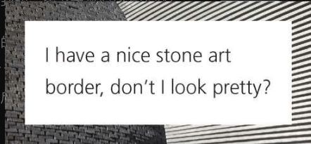

<!-- more -->

## 基础知识

**1. CSS 3的内容以及由来：**

CSS3 并没有在任何规范中定义过，指的是一个非正式的集合，CSS 2后，CSS工作组意识到语言已经变得非常庞大，无法塞进单个规范中，将CSS打散到不通模块中，它包括CSS规范第三版（延续CSS2.1已有特性的模块）再加上一些版本号还是1的新规范，如：

- CSS层叠与继承（http://w3.org/TR/css-cascade-3）
- CSS颜色（http://w3.org/TR/css3-color）
- CSS变形（http://w3.org/TR/css-transforms-1）
...

**2. 实现实验性的特性方案：**

- **浏览器前缀**：在名称前面加上自己特有的前缀。最常见的前缀分别是Firefox的-moz-、IE的-ms-、Opera的-o-以及Safari和Chrome的-webkit-。非常不DRY
- **通过配置开关启用**。有效防止开发者在生产环境中滥用

## CSS 编码技巧

**currentColor**

表示元素的 color 属性的值，比如想让所有的水平分割线（所有
元素）自动与文本的颜色保持一致

currentColor本身就是很多CSS颜色属性的初始值，比如border-color和outline-color，以及text-shadow和box-shadow的颜色

**继承：inherit**

绑定到父元素的计算值（对伪元素来说，则会取生成该伪元素的宿主元素）

比如：创建提示框的时候，你可能希望它的小箭头能够自动继承背景和边框的样式

## 示例

1. 实现纯色背景 + 半透明边框 

2. 使用单个元素的前提下，实现多重边框

3. 实现条纹背景（横向、纵向、斜向）

4. 使用单个元素的前提下，实现图片边框

<!-- 六 复杂背景：棋盘、圆点重复 -->

<!-- 4. 如何画一个半圆
1. 画一个饼图 -->

## 相关链接

[1] [书中所有示例](https://play.csssecrets.io/)

