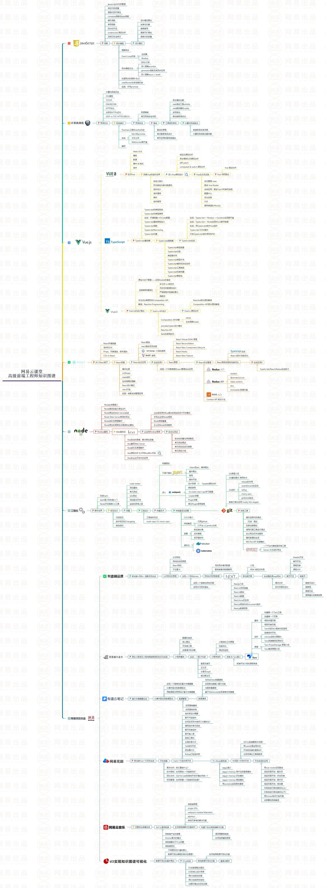

<!-- more -->

## 技能树

网易云课堂嫖的图，可供参考

## http 

### http 状态码

- 1xx: 表示目前是协议处理的中间状态，还需要后续操作。
- 2xx: 表示成功状态。
- 3xx: 重定向状态，资源位置发生变动，需要重新请求。
- 4xx: 请求报文有误。
- 5xx: 服务器端发生错误。

## 3次握手、4次挥手

握手目的，确认双方的发送能力、接收能力是否正常。

每个阶段各确认了什么：

第一次握手：客 => 服，客户端发送能力正常

第二次握手：服 => 客，+ 服务端接收能力、服务端发送能力，客户端接收能力（但是服务端不知道）

第三次握手：客 => 服，+ 客户端接收能力（服务端知道）

## 什么是函数编程

函数编程的一些关键概念(from chatgpt)：

纯函数（Pure Functions）：纯函数是指具有以下特性的函数：

1. 它的输出仅由输入决定，对于相同的输入始终产生相同的输出。
它不依赖于或修改外部状态。
它没有副作用，即不会对除函数返回值以外的任何东西产生影响。
纯函数的特性使得它们具有可预测性、可测试性和可维护性，并且易于并行化处理。

2. 不可变性（Immutability）：函数式编程鼓励使用不可变的数据结构和避免直接修改数据。不可变性意味着数据一旦创建就不能被修改，而是通过创建新的数据来表示状态的变化。这种方式可以减少并发问题，并简化代码的推理和调试。

3. 高阶函数（Higher-Order Functions）：函数可以作为参数传递给其他函数，或者作为函数的返回值返回。高阶函数使得代码更具有抽象性和灵活性，可以通过组合和转换函数来构建复杂的逻辑。

4. 函数组合（Function Composition）：函数组合是将多个函数连接在一起以生成新函数的过程。通过将一个函数的输出作为另一个函数的输入，可以创建出更复杂的功能。函数组合有助于减少代码的重复性，提高代码的可读性和可维护性。

5. 无可变数据流（Immutable Data Flow）：函数式编程鼓励使用无可变数据流的方式处理数据。通过将数据传递给函数链，每个函数都返回一个新的数据集，而不是直接修改原始数据。这种方式简化了代码的理解和调试，使得数据流的变化更容易追踪。

函数式编程通常关注于如何构建不可变的、可组合的和可重用的函数，以及如何将这些函数组合成更大的功能单元。它强调数据和行为的分离，以及通过函数的组合和转换来处理数据的方式。函数式编程在处理大规模数据、并行计算和构建高度可靠的系统方面具有很多优势。

## 前段基础相关笔记

- [3次握手4次挥手](./three-way-handshake.md)
- [前端常用单位说明](./fe-unit.md)
