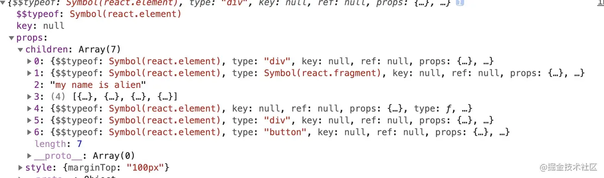
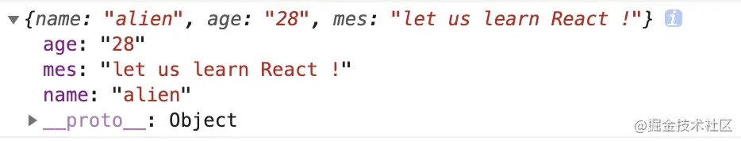

# 《React进阶指南》笔记

## 前言

> 原文：[《React 进阶指南》](https://juejin.cn/book/6945998773818490884)
> 个人 demo: demo/react-demo

源码下载：

```sh
git clone https://hub.fastgit.org/facebook/react.git
git checkout v16.19
```

## 认识 JSX

### JSX 被 React 处理成什么

```
const toLearn = [ 'react' , 'vue' , 'webpack' , 'nodejs'  ]

const TextComponent = ()=> <div> hello , i am function component </div>

class Index extends React.Component{
    status = false /* 状态 */
    renderFoot=()=> <div> i am foot</div>
    render(){
        /* 以下都是常用的jsx元素节 */
        return <div style={{ marginTop:'100px' }}   >
            { /* element 元素类型 */ }
            <div>hello,world</div>
            { /* fragment 类型 */ }
            <React.Fragment>
                <div> 👽👽 </div>
            </React.Fragment>
            { /* text 文本类型 */ }
            my name is alien
            { /* 数组节点类型 */ }
            { toLearn.map(item=> <div key={item} >let us learn { item } </div> ) }
            { /* 组件类型 */ }
            <TextComponent/>
            { /* 三元运算 */  }
            { this.status ? <TextComponent /> : <div>三元运算</div> }
            { /* 函数执行 */ }
            { this.renderFoot() }
            <button onClick={ ()=> console.log( this.render() ) } >打印render后的内容</button>
        </div>
    }
}
```

1. babel 编译：React.createElement, 注意 3 个参数作用
   
2. createElement 处理后的样子 注意转换类型的映照关系
   
3. React 底层调和处理后，终将变成什么？
   React element 对象的每一个子节点都会形成一个与之对应的 fiber 对象，然后通过 sibling、return、child 将每一个 fiber 对象联系起来。

### React API

- React.Children.toArray，扁平化，规范化 children 数组
- React.Children.forEach，遍历 children，内部已扁平化 children
- React.createElement
- react.cloneElement

### QA

1. 老版本的 React 中，为什么写 jsx 的文件要默认引入 React

```
import React from 'react'
function Index(){
    return <div>hello,world</div>
}
```

答：因为 jsx 在被 babel 编译后，写的 jsx 会变成上述 React.createElement 形式，所以需要引入 React，防止找不到 React 引起报错。

## Component

可通过原型链的方式给类增加默认操作

```
class Index extends React.Component{
    constructor(...arg){
       super(...arg)                        /* 执行 react 底层 Component 函数 */
    }
    state = {}                              /* state */
    static number = 1                       /* 内置静态属性 */
    componentDidMount(){                    /* 生命周期 */
        console.log(Index.number,Index.number1) // 打印 1 , 2
    }
    render(){                               /* 渲染函数 */
        return <div style={{ marginTop:'50px' }} onClick={ this.handerClick }  >hello,React!</div>
    }
}
Index.number1 = 2                           /* 外置静态属性 */
Index.prototype.handleClick = ()=> console.log(222) /* 方法: 绑定在 Index 原型链的 方法*/
```

组件的继承：state 和生命周期会被继承后的组件修改。像下列 demo 中，Person 组件中的 componentDidMount 生命周期将不会被执行。

```
/* 人类 */
class Person extends React.Component{
    constructor(props){
        super(props)
        console.log('hello , i am person')
    }
    componentDidMount(){ console.log(1111)  }
    eat(){    /* 吃饭 */ }
    sleep(){  /* 睡觉 */  }
    ddd(){   console.log('打豆豆')  /* 打豆豆 */ }
    render(){
        return <div>
            大家好，我是一个person
        </div>
    }
}
/* 程序员 */
class Programmer extends Person{
    constructor(props){
        super(props)
        console.log('hello , i am Programmer too')
    }
    componentDidMount(){  console.log(this)  }
    code(){ /* 敲代码 */ }
    render(){
        return <div style={ { marginTop:'50px' } } >
            { super.render() } { /* 让 Person 中的 render 执行 */ }
            我还是一个程序员！    { /* 添加自己的内容 */ }
        </div>
    }
}
export default Programmer
```

类组件和函数组件的区别：

1. 类组件的本质就是 类和函数还有 oop 思想中的继承，在此之上需要内置处理 state 和 props 组件的状态维护，状态 -> ui -> 渲染
2. 函数组件 没有实例化的概念，FP 思想，每个组件应该只处理一个逻辑事物不想 class 组件那么复合，另外它没有转态存储能力必须依赖 hook

### State

组件初始化过程中绑定了负责更新的 Updater 对象，对于如果调用 setState 方法，实际上是 React 底层调用 Updater 对象上的 enqueueSetState 方法。

#### 类组件

**unstable_batchedUpdates**:异步环境下，继开启批量更新模式

```
setTimeout(()=>{
    unstable_batchedUpdates(()=>{
        this.setState({ number:this.state.number + 1 })
        console.log(this.state.number)
        this.setState({ number:this.state.number + 1})
        console.log(this.state.number)
        this.setState({ number:this.state.number + 1 })
        console.log(this.state.number)
    })
})
```

**flushSync**:提升更新优先级

```
handerClick=()=>{
    setTimeout(()=>{
        this.setState({ number: 1  })
    })
    this.setState({ number: 2  })
    ReactDOM.flushSync(()=>{
        this.setState({ number: 3  })
    })
    this.setState({ number: 4  })
}
render(){
   console.log(this.state.number)
   return ...
}
```

#### 函数组件

```
[ ①state , ②dispatch ] = useState(③initData)
```

- 注意 ② ③ 是函数的情况

#### QA

1. 为什么异步环境中批量更新规则被打破， setState 后走 render??????宏微任务
2. useState 参数可以是个函数，初始值是函数执行后的结果？
3. RN 没有 ReactDOM.flushSync
4. legacy 模式，还有 blocking 模式、concurrent 模式概念
5. （图）合并 state 和调和树的顺序是否应该反过来
6. 合并 state 的过程在哪儿
7. 下列点击事件的打印结果
8. 宏任务微任务？js 任务系统
9. useState 初始化对象是一个复杂对象的情况，改变初始对象，useState 的对象会改变吗

```
handleClick= () => {
          this.setState({ number:this.state.number + 1 },()=>{   console.log( 'callback1', this.state.number)  })
          console.log(this.state.number)
          this.setState({ number:this.state.number + 2 },()=>{   console.log( 'callback2', this.state.number)  })
          console.log(this.state.number)
          this.setState({ number:this.state.number + 3 },()=>{   console.log( 'callback3', this.state.number)  })
          console.log(this.state.number)
    }
```

```
0, 0, 0, callback1 3 ,callback2 3 ,callback3 3
```

### 自定义 Hooks

#### QA

- 执行副作用、demo 好像有问题，敲一个

## 随记

- 扁平化的意思？树形结构如何扁平化
- fiber 对象

## 深入 props

### props 操作技巧

抽象 Props 一般用于**跨层级传递 props**，一般不需要具体指出 props 中某个属性，而是将 props 直接传入或者是抽离到子组件中

#### 混入 props

```js
function Son(props) {
  console.log(props);
  return <div> hello,world </div>;
}
function Father(props) {
  const fatherProps = {
    mes: "let us learn React !",
  };
  return <Son {...props} {...fatherProps} />;
}
function Index() {
  const indexProps = {
    name: "alien",
    age: "28",
  };
  return <Father {...indexProps} />;
}
```

打印

将 Index 组件 indexProps 抽象传递给 Son，一方面混入 fatherProps

#### 抽离 props

```js
function Son(props) {
  console.log(props);
  return <div> hello,world </div>;
}

function Father(props) {
  const { age, ...fatherProps } = props;
  return <Son {...fatherProps} />;
}
function Index() {
  const indexProps = {
    name: "alien",
    age: "28",
    mes: "let us learn React !",
  };
  return <Father {...indexProps} />;
}
```

将 indexProps 中的 age 属性抽离出来。

#### 隐式注入 props

React.cloneElement

#### 总结

- 对 props 中 children 的操作，显示与否、判断类型做自己的渲染逻辑等
- 对 props 中的 children 的 props 操作，注入新的 props 等

容器技巧 => 获取 children => 做自定义操作

#### QA

FormItem.displayName 为什么这么取 children.type.displayName

## 生命周期

- 挂载
  

constructor -> getDerivedStateFromProps / componentWillMount -> render -> componentDidMount

- 更新
  

componentWillReceiveProps( props 改变) / getDerivedStateFromProp -> shouldComponentUpdate -> componentWillUpdate -> render -> getSnapshotBeforeUpdate -> componentDidUpdate

- 销毁
  commit 阶段调用 componentWillUnmount

- 总览
  

### 各阶段要点

- getDerivedStateFromProps：只是静态方法、访问不到 this，组件更新，就会执行 getDerivedStateFromProps，不管是 props 改变，还是 setState ，或是 forceUpdate 。
- getSnapshotBeforeUpdate: 获取 更新前 DOM 信息的最佳时期，getSnapshotBeforeUpdate 将返回一个值作为一个 snapShot(快照)，传递给 componentDidUpdate 作为第三个参数

## context

### consumer 的三种写法

- useContext
- 函数式
- contextType

```jsx
const ThemeContext = React.createContext(null);
// 类组件 - contextType 方式
class ConsumerDemo extends React.Component {
  render() {
    const { color, background } = this.context;
    return <div style={{ color, background }}>消费者</div>;
  }
}
ConsumerDemo.contextType = ThemeContext;

const Son = () => <ConsumerDemo />;
```

### Provider 特性

1. Provider 作为提供者传递 context ，provider 中 value 属性改变会使所有消费 context 的组件重新更新。
2. Provider 可以逐层传递 context，下一层 Provider 会覆盖上一层 Provider。

### QA

- contextType 底层如何处理的

### 拓展

- 注意其中的例子：Provider value 改变 导致组件树重新渲染的例子
  > 没有 memo 处理，useState 会让 ProviderDemo 重新 render ，此时 son 没有处理，就会跟随父组件 render

## 高阶组件

高阶组件能复用哪些代码逻辑？

- 渲染劫持：懒加载、动态加载、渲染与否、统一空展示、统一异常展示、替换节点等
- 混入 Props: 新增 props,传递已知 props 值，比如项目中想让一个非 Route 组件，也能通过 props 获取路由实现跳转，但是不想通过父级路由组件层层绑定 props ，这个时候就需要一个 HOC 把改变路由的 history 对象混入 props 中，于是 withRoute 诞生了。
- 监控组件内部状态：如对组件内的点击事件做一些监控，或者加一次额外的生命周期，对现有 props 做一些加工重新传递

两种不同的高阶组件

- 属性代理：无侵入、多层嵌套比较安全、低耦合，注意处理 Ref、静态属性
- 反向继承：便于绑定生命周期，无需处理 Ref、静态属性，多个反向继承会相互覆盖，耦合较高，需要知道原始组件

### 示例代码

1. 强化 props

加入一些其他的 props ，强化原始组件功能

```js
// 让组件也可以获取到路由对象，进行路由跳转等操作
function withRouter(Component) {
  const displayName = `withRouter(${Component.displayName || Component.name})`;
  const C = (props) => {
    /*  获取 */
    const { wrappedComponentRef, ...remainingProps } = props;
    return (
      <RouterContext.Consumer>
        {(context) => {
          return (
            <Component
              {...remainingProps} // 组件原始的props
              {...context} // 存在路由对象的上下文，history  location 等
              ref={wrappedComponentRef}
            />
          );
        }}
      </RouterContext.Consumer>
    );
  };

  C.displayName = displayName;
  C.WrappedComponent = Component;
  /* 继承静态属性 */
  return hoistStatics(C, Component);
}
export default withRouter;
```

### 注意事项

1. 不要在函数组件内部或类组件 render 函数中使用 HOC

每一次类组件触发 render 或者函数组件执行都会产生一个新的 WrapHome，react diff 会判定两次不是同一个组件，那么就会卸载老组件，重新挂载新组件，造成新能浪费

2. 处理 Ref
3. 处理静态属性
4. 多 HOC 时 注意是否会相互影响

## 渲染控制

useMemo 原理：useMemo 会记录上一次执行 create 的返回值，并把它绑定在函数组件对应的 fiber 对象上，只要组件不销毁，缓存值就一直存在，但是 deps 中如果有一项改变，就会重新执行 create ，返回值作为新的值记录到 fiber 对象上

注意给组件 props 传箭头函数、对象的情况，会使 PureComponent 失效

React.memo 当二个参数 compare 不存在时，会用浅比较原则处理 props ，相当于仅比较 props 版本的 pureComponent

打破渲染限制：

1. forceUpdate。类组件更新如果调用的是 forceUpdate 而不是 setState ，会跳过 PureComponent 的浅比较和 shouldComponentUpdate 自定义比较。其原理是组件中调用 forceUpdate 时候，全局会开启一个 hasForceUpdate 的开关。当组件更新的时候，检查这个开关是否打开，如果打开，就直接跳过 shouldUpdate 。

2. context 穿透，上述的几种方式，都不能本质上阻断 context 改变，而带来的渲染穿透，所以开发者在使用 Context 要格外小心，既然选择了消费 context ，就要承担 context 改变，带来的更新作用。

渲染流程图


## 事件原理

- 阻止冒泡：React 中如果想要阻止事件向上冒泡，可以用 e.stopPropagation()

```js
export default function Index() {
  const handleClick = (e) => {
    e.stopPropagation(); /* 阻止事件冒泡，handleFatherClick 事件讲不在触发 */
  };
  const handleFatherClick = () => console.log("冒泡到父级");
  return (
    <div onClick={handleFatherClick}>
      <div onClick={handleClick}>点击</div>
    </div>
  );
}
```

## Fiber

```js
function FiberNode() {
  this.tag = tag; // fiber 标签 证明是什么类型fiber。
  this.key = key; // key调和子节点时候用到。
  this.type = null; // dom元素是对应的元素类型，比如div，组件指向组件对应的类或者函数。
  this.stateNode = null; // 指向对应的真实dom元素，类组件指向组件实例，可以被ref获取。

  this.return = null; // 指向父级fiber
  this.child = null; // 指向子级fiber
  this.sibling = null; // 指向兄弟fiber
  this.index = 0; // 索引

  this.ref = null; // ref指向，ref函数，或者ref对象。

  this.pendingProps = pendingProps; // 在一次更新中，代表element创建
  this.memoizedProps = null; // 记录上一次更新完毕后的props
  this.updateQueue = null; // 类组件存放setState更新队列，函数组件存放
  this.memoizedState = null; // 类组件保存state信息，函数组件保存hooks信息，dom元素为null
  this.dependencies = null; // context或是时间的依赖项

  this.mode = mode; //描述fiber树的模式，比如 ConcurrentMode 模式

  this.effectTag = NoEffect; // effect标签，用于收集effectList
  this.nextEffect = null; // 指向下一个effect

  this.firstEffect = null; // 第一个effect
  this.lastEffect = null; // 最后一个effect

  this.expirationTime = NoWork; // 通过不同过期时间，判断任务是否过期， 在v17版本用lane表示。

  this.alternate = null; //双缓存树，指向缓存的fiber。更新阶段，两颗树互相交替。
}
```

### render & commit

#### render

```js
// react-reconciler/src/ReactFiberWorkLoop.js

function workLoop() {
  while (workInProgress !== null) {
    workInProgress = performUnitOfWork(workInProgress);
  }
}
```

调和过程中，每一个发生更新的 fiber 都会作为一次 workInProgress

workLoop 就是执行每一个单元的调度器，如果渲染没有被中断，那么 workLoop 会遍历一遍 fiber 树

```js
// react-reconciler/src/ReactFiberWorkLoop.js

function performUnitOfWork() {
  next = beginWork(current, unitOfWork, renderExpirationTime); // 按照 child 指针逐层向下调和，期间会执行函数组件，实例类组件，diff 调和子节点，打不同effectTag。
  if (next === null) {
    next = completeUnitOfWork(unitOfWork); // 向上归并的过程，如果有兄弟节点，会返回 sibling兄弟，没有返回 return 父级，一直返回到 fiebrRoot ，期间可以形成effectList，对于初始化流程会创建 DOM ，对于 DOM 元素进行事件收集，处理style，className等。
  }
}
```

总结 beginWork 作用如下：

对于组件，执行部分生命周期，执行 render ，得到最新的 children 。
向下遍历调和 children ，复用 oldFiber ( diff 算法)，diff 流程在第十二章已经讲过了。
打不同的副作用标签 effectTag ，比如类组件的生命周期，或者元素的增加，删除，更新。

completeUnitOfWork 的流程是自下向上的，那么 completeUnitOfWork 过程主要做写什么呢？

首先 completeUnitOfWork 会将 effectTag 的 Fiber 节点会被保存在一条被称为 effectList 的单向链表中。在 commit 阶段，将不再需要遍历每一个 fiber ，只需要执行更新 effectList 就可以了。
completeWork 阶段对于组件处理 context ；对于元素标签初始化，会创建真实 DOM ，将子孙 DOM 节点插入刚生成的 DOM 节点中；会触发 diffProperties 处理 props ，比如事件收集，style，className 处理，在 15 章讲到过。

#### commit

主要做的事就是执行 effectList，更新 DOM，执行生命周期，获取 ref 等操作

#### 调和 + 异步调度 流程总图


### Question

- 什么是 fiber ？
- Fiber 架构解决了什么问题？
- Fiber root 和 root fiber 有什么区别？
- 不同 fiber 之间如何建立起关联的？
- React 调和流程？
- 两大阶段 commit 和 render 都做了哪些事情？
- 什么是双缓冲树？
- 有什么作用？
- Fiber 深度遍历流程？
- Fiber 的调和能中断吗？
- 如何中断？
- 假设某个 5 层 Fiber 数已经创建完毕，3 层发生更新时，调和从什么地方开始调和
- element 和 Fiber 如何联系起来的

## Hooks 原理

### Questions
  
① React Hooks 为什么必须在函数组件内部执行？React 如何能够监听 React Hooks 在外部执行  
并抛出异常。  
② React Hooks 如何把状态保存起来？保存的信息存在了哪里？  
③ React Hooks 为什么不能写在条件语句中？  
④ useMemo 内部引用 useRef 为什么不需要添加依赖项，而 useState 就要添加依赖项。  
⑤ useEffect 添加依赖项 props.a ，为什么 props.a 改变，useEffect 回调函数 create 重  
新执行。  
⑥ React 内部如何区别 useEffect 和 useLayoutEffect ，执行时机有什么不同？

### 
## 随记

- 如何分享
- 每章以后需要知道该章要点,相关问题面试时可能问到
