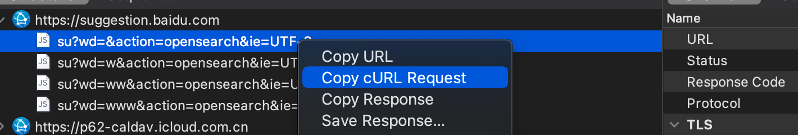

<!-- more -->

## 前言

在b站偶然刷到这个视频--[《【麻省理工现场授课视频】计算机编程中最重要的一门课程------编程工具的使用》][bilibili]，发现日常中经常使用却一直忽略的工具--终端，有很多即使是编程之外也可以使用的技巧。
借此查阅总结了一些日常操作中比较实用的指令，如快速查目标目录下中最大的几个文件、文件内容比较、计数等等。

本文只是抛砖概述有什么指令可用，每个点都不会太深入，若有感觉比较实用的指令，可根据备注的序号，在文末查看参考文章链接。

ps: 以下示例均在 mac 终端 Zsh 中运行，其他终端中可能会略有偏差。

ps2: 本文持续更新版收录[在此][my-blog]

## 首先建议了解的技巧、概念

### 如何快速查询指令及使用的方法：

- **`man + 指令名`**：查看系统中的指令帮助、配置文件等信息。如`man ls`


- **`tldr + 指令名`**: 比`man`更加简单，提供了更多的示例，安装及详细使用方式见[官网链接](https://hub.fastgit.org/tldr-pages/tldr)


- **`任意内容 + Tab`**: 自动补全指令，如输入`find -`，再点击Tab键会提示以下信息：


大部分的指令可通过上述方式在系统中查看更详细的说明。

### 终端快捷键

终端中某些快捷键和编辑器快捷键相同，如`Ctrl A`、`Ctrl E` VSCode 也可用，记住一些常用快捷键可提升多处开发体验。
<!-- 同步其他文章 -->

```bash
Cmd K  # 清屏，清空终端
Ctrl L # 清屏，把末尾行置顶，并不清空，等于终端输入`clear`
Ctrl A # 光标移动至行开始
Ctrl E # 光标移至行末尾[8]
Ctrl K # 将光标以后的内容删除
Ctrl U # 清空当前输入
Ctrl R # 在历史命令中查找[8]，比如之前某条命令执行失败，可通过此方式快速找到对应命令重新执行
```


### 一些基础概念

- **什么是Shell**：Shell 是指一种应用程序，这个应用程序提供了一个界面，用户通过这个界面访问操作系统内核的服务。业界所说的Shell通常指Shell脚本。[1]

- **标准输入、标准输出**：一个命令通常从一个叫标准输入的地方读取输入，默认情况下，这恰好是你的终端。同样，一个命令通常将其输出写入到标准输出，默认情况下，这也是你的终端。[11]

- **输入/输出重定向**：[11]
  - `>`：输出重定向
  - `<`：输入重定向
  - `>>`：以追加的方式输出重定向

- **管道操作符`|`**：处理前面一个指令传出的正确输出信息，并将其传入下一个指令

```bash
$ echo hello > hello.txt
$ cat hello.txt
hello
# 等于
$ cat < hello.txt
hello
```

**通配符**[5]：

- `*`: 匹配0或任意个字符
- `?`: 匹配一个任意字符
- `[-]`: 匹配中括号的字符。例如[a-b]，匹配小写字母，只会匹配集合中的一个
- `[^]`: 匹配除了中括号的一个字符。例如[^0-9]，匹配除了数字的字符，只会匹配集合中的一个
- `{ab,ba}`: 匹配其中一个字符串。例如匹配ab或ba

```bash
# 打印所有以.sh结尾的文件
$ ls *.sh

# 打印所有以.md、.txt结尾的文件
$ ls *.{md,txt}

# 创建文件：touch1.md、touch4.md、touch3.md、touch5.md
$ touch touch{1,3,4,5}.md

$ touch  {f1,f2}/{a..e}.md # 等于 touch f1/a.md、f1/b.md、f1/c.md、f1/d.md、f1/e.md、f2/a.md、f2/b.md、f2/c.md、f2/d.md、f2/e.md
```

## 实用命令

### mkdir

**`mkdir path/directory`**: 创建新文件夹，`path`不存在或`directory`存在会抛出错误，`mkdir -p path/directory`:递归的创建一个某个目录，目录存在则跳过，不会抛出错误。
### open

**`open path`**：打开文件、目录或应用程序。`open .`：在"访达（finder）"中打开当前文件夹。

### history

**`history`**：显示历史执行过的命令
```bash
$ history 1 # 显示全部
$ history 20 # 显示近20条命令，在zsh中是显示从20到最新一条
$ history -d offset # 删除从0到offset的记录
```
### date

  
**`date`**：查看当前时间，更多信息：https://ss64.com/osx/date.html.

```bash
$ date
2022年 5月11日 星期三 15时31分15秒 CST
# 使用默认区域设置的格式显示当前日期：
$ date +"%c"
# 以 UTC 和 ISO 8601 格式显示当前日期：
$ date -u +"%Y-%m-%dT%H:%M:%SZ"
# 将当前日期显示为 unix 时间戳（自 1970-01-01 00:00:00 以来的秒数）：
$ date +%s
# 使用默认格式显示特定日期（格式化指定 UNIX 时间戳）：
$ date -r 1473305798
```
### touch

**`touch`**：设置文件的修改和访问时间，如果没有对应文件将新建一个。
```bash
$ touch lalala.md
$ ls
lalala.md
```
### shellcheck

**`shellcheck yourscript`**: 检查脚本是否有语法错误，[shellcheck工具安装及使用方式](https://github.com/koalaman/shellcheck#from-your-terminal)


### curl

**`curl`**：发出网络请求，然后得到和提取数据，显示在"标准输出"（stdout）上。[15]，各个选项含义可参考[阮一峰大佬的blog][curl]

```bash
# 什么参数都不加默认是get请求
$ curl www.baidu.com 
<!DOCTYPE html>
<!--STATUS OK--><html> <head><meta http-equiv=content-type content=text/html;charset=utf-8><meta http-equiv=X-UA
...
```

接口出现问题时，用此方法复现出问题的接口非常方便。假设以下是开发中的一个遇到问题的接口，通过Charles中抓包后，`Copy cURL Request`



可以得到如下信息，这样所有的请求信息变拿到了，可以完美复现问题场景，挨个排查问题

```bash
curl -H "Host: suggestion.baidu.com" -H "Sec-Fetch-Site: none" -H "Sec-Fetch-Mode: no-cors" -H "Sec-Fetch-Dest: empty" -H "User-Agent: Mozilla/5.0 (Macintosh; Intel Mac OS X 10_15_7) AppleWebKit/537.36 (KHTML, like Gecko) Chrome/101.0.4951.54 Safari/537.36" -H "Accept-Language: zh-CN,zh;q=0.9" -H "Cookie: BDUSS_BFESS=Z2UVJ4UERzNTVyWHVRb21KLTVkcVdOdWhDMDl3aG1jWkdpMFA4M2x3R2NvbEppRVFBQUFBJCQAAAAAAAAAAAEAAAAkAEGTxcu1wsCtubG1xLn71q0AAAAAAAAAAAAAAAAAAAAAAAAAAAAAAAAAAAAAAAAAAAAAAAAAAAAAAAAAAAAAAAAAAJwVK2KcFStiQW; BDSFRCVID_BFESS=w4FOJeC62Z7x5j3DOYtxtKoBoVALqC3TH6ao7gE5pd23RU6n14g8EG0PhM8g0KAbx4seogKK0mOTHv-F_2uxOjjg8UtVJeC6EG0Ptf8g0f5; BAIDUID_BFESS=698F99AAD30B1558728C57D13A001C25:FG=1" --compressed "https://suggestion.baidu.com/su?wd=&action=opensearch&ie=UTF-8"
```


### cp

**`cp source target`**：文件拷贝。  
```bash
$ cp lalala.md hhhh.md
$ ls
hhhh.md   lalala.md
```
### cd

**`cd`**: 切换当前工作目录

```bash
$ cd ~  # 切换到当前用户根目录，等于直接输入`cd`
$ cd /  # 切换到所有用户共享的根目录
$ cd -  # 回到上一次的目录
```
### pwd

**`pwd`**：查看终端当前所在路径

### mv

**`mv source target`**：为文件或目录改名、将文件或目录移入其它位置

```bash
# -f  -- 覆盖前不提示
# -i  -- 覆盖前提示
# -n  -- 不覆盖已存在的文件
# -v  -- 移动文件后显示文件名
$ mv -v mv.md mv2.md
mv.md -> mv2.md
```
### ls

**`ls`**:列出目录下的内容，`ls -l`：查看当前目录下的所有文件及详细信息

```bash
$ ls -l
total 0
-rw-r--r--  1 ych  staff  0  5 11 19:39 lalala.md
```
### cat

**`cat`**：连接和打印文件，`cat  -n 文件`：打印文件内容，显示行号

```bash
$ ls node_modules | cat -n
     1	@ampproject
     2	@babel
     3	@hapi
     ...
```

```bash
# 在 macOS 上使用 pbcopy 命令：
$ cat temp.txt | pbcopy

# 在 Linux 上使用 xclip 命令：
$ cat temp.txt | xclip -selection clipboard
```

### tac

**`tac`**: 与cat相反，反转输出
### du

**`du`**:查看磁盘占用，`du -h 文件名`：使用人类易读的单位打印文件磁盘占用（注意并不等于文件大小）。

```bash
# 使用人类易读单位
$ du -h package.json
4.0K	package.json
# 使用人类易读单位、查看目录大小
$ du -sh .git
367M    .git
# 查看当前目录大小，层级1层，忽略node_modules、.git
$  du -h -I node_modules -I .git -d 1 
```
### xargs

**`xargs`**：将标准输入转为命令行参数。一些命令不支持标准输入，只能直接在命令行输入参数，导致无法导致无法用管道命令传递参数[10]，此时可用`xargs`如：

```bash
$ echo "hello world" | echo
# 无输出
$ echo "hello world" | xargs echo
hello world
# 开发时建立了很多以test-开头的测试分支，想一次性删除
$ git branch | grep "test-*" | xargs git branch -D
```

更详细的用法可参考[阮一峰的blog](https://www.ruanyifeng.com/blog/2019/08/xargs-tutorial.html)
### wc

**`wc`**: 计数行数、词数（换行符、空格符分割）、字节数。
 
```bash
wc [-clmw] [file ...]
-l  # 行数
-c  # 字节数
-w  # 词数

# 如：统计当前目录下文件数
$ find . -type f | wc -l
42
```

### who

**`who`**：显示登陆者和相关数据（进程信息，启动时间等）

```bash
# 显示当前终端会话信息
$ who am i
ych      ttys002  May  6 18:10
# 显示所有可用信息，并展示表头
$ who -a -H
USER     LINE     WHEN         IDLE  	   PID	COMMENT
reboot   ~        May  4 17:41   .   	     1
ych      console  May  4 17:42  old  	   153
ych      ttys002  May  6 18:10   .   	 55852
...
```
### head

**`head`**：输出文件的头部信息
```bash
# 输出文件的前几行：
$ head -n 行数 文件名
# 输出文件的前几个字节：
$ head -c 字节数 文件名
```
如：查看历史指令从1200开始的前十条
```bash
$ history 1200 | head -n 10
 1200  echo BB > BB.txt
 1201  ls | sort
 1202  echo ZZ > ZZ.txt
 1203  ls | sort
 1204  ls -i
 1205  ls | sort --ignore-case
 1206  sort -
 1207  sort -f
 1208  ls | sort -f
 1209  ls | sort -S
```
### tail

**`tail`**：输出文件的末尾信息
```bash
# 输出文件的末尾几行：
$  tail -n count path/to/file
# 输出开始至末尾count行
$ tail -n +count path/to/file
# 输出文件的末尾几个字节：
$ tail -c count path/to/file
```
### rm

**`rm`**：尝试删除指定的非目录类型文件。

```bash
-r # 递归删除目录及子文件
-f # 强制删除文件，无视文件权限，不展示二次确认信息或错误输出
-i # 交互式删除，每次删除前都会提示
```
```bash
$ ls
a b c
$ rm -d -i a b c
remove a? y
remove b? y
remove c? n
$ ls
c
```
### source

**`source`**： 在当前终端环境下读取并执行文件中的命令[18]，如：

```bash
# 有这样一个文件
$ cat mcd.sh
mcd(){
	mkdir -p "$1"
	cd "$1"
}
echo "lode mcd.sh"

# 读取、执行文件
$ source mcd.sh
lode mcd command

$ pwd
/Users/ych/documents/learning/shell_start/src

# 增加了一条新指令mcd可用
$ mcd lalalala
$ pwd
/Users/ych/documents/learning/shell_start/src/lalalala
```
### ifconfig

**`ifconfig`**：配置网络接口参数

显示本机IP:

```bash
$ ifconfig en0 | grep "inet " --color=auto
	inet 10.6...
# 等于
$ grep "inet " <(ifconfig en0) --color=auto
	inet 10.6...
```
> en0: Ethernet 0，以太网接口 0，大多数情况en0是你的WIFI[6]

### grep

**`grep pattern 文件`**：在给定的文件中，按行匹配`pattern`的内容，打印该行。

```bash
-i  # 忽略搜索字符串的大小写
-v  # 取反，输出不匹配pattern的那些文本行
-n  # 输出行号
-l  # 输出能匹配pattern的文件名
-c  # 输出匹配成功的行数
--exclude  # 排除需要搜索的文件
--exclude-dir # 排除需要搜索的目录
--include  # 指定需要搜索的文件
```

**示例：**

1. node_module随便找个md文件，打印标题和行号

```bash
$ grep -n "^#" node_modules/kleur/readme.md
22:## Features
38:## Install
45:## Usage
60:### Chained Methods
71:### Nested Methods
83:### Conditional Support
...
```
### tree

**`tree`**：以树形结构打印目录内容

以树的形式显示当前目录的内容。

- 显示深度达到 “级数” 级的文件和目录（其中 1 表示当前目录）：
```bash
$ tree -L 级数
```
- 只显示目录：
```bash
$  tree -d
```  
- 同时显示隐藏文件：
```bash
$  tree -a
```   
- 打印没有缩进行的树，显示完整路径（使用-N不转义空格和特殊字符）：
```bash
$  tree -i -f
```   
- 以可读格式打印每个文件节点的大小，目录显示其累积大小（类似在du命令中所示）：
```bash
$  tree -s -h --du
```
- 使用通配符（glob）模式在树层次结构中查找文件，并删除不包含匹配文件的目录：
```bash
$  tree -P '*.txt' --prune
```  
- 在树层次结构中查找目录，删除不属于所需目录的目录：
```bash
$  tree -P 文件夹名 --matchdirs --prune
```    

**示例**：

```bash
tree -L 1 node_modules
node_modules
├── @ampproject
├── @babel
├── @hapi
├── @jest
├── @jridgewell
├── @react-native
...
```
### find

**`find`**：文件查找[9]

**操作符**


- `-and`、`-a`: 与，一行中的两个语句隐含用`-a`连接，第一个语句为false则后面不再执行。

- `-or`、`-o`: 或

- `-not`、`!`: 非

```bash
expr1 -and expr2
# 等于
expr1 -a expr2
# 等于
expr1 expr2
```
**选项**

某些情况可以指定数字类型的参数`n`为以下形式：


- `+n` 超过n

- `-n` 少于n

- `n`  等于n

```bash
# 以下参数中的 n均可以被 +n、-n替换
-amin n # 最后一次访问文件的时间大于、等于、小于n分钟
-size n[cwbkMG] # 文件使用空间大于、等于、小于n(cwbkMG)
	b # 512 字节
	c # 字节
	w # 双字节
	k # kb
	M # mb
	G # gb
-type # 查找某一类型的文件，诸如：
  b # 块设备文件。
  d # 目录。
  c # 字符设备文件。
  p # 管道文件。
  l # 符号链接文件。
  f # 普通文件
-name pattern # 基于文件名查找，可使用正则
-maxdepth levels # 在起点以下最多levels层目录下查找
```

**示例**：

1. 查找当前目录下除了node_modules目录中的所有md文件

```bash
find . -name "*.md" -a ! -path "./node_modules/*"
```

2. 显示node_modules中所有大于1MB的文件

```bash
$ find node_modules ! -type d -size +1M | xargs du -h
 21M	node_modules/@sentry/cli/sentry-cli
1.7M	node_modules/react-native/node_modules/hermes-engine/osx-bin/hermesc
2.9M	node_modules/react-native/node_modules/hermes-engine/linux64-bin/hermesc
...
```

### cut

**`cut`**: 从标准输入或文件中剪切字段，每列序号从1开始

**选项**

```bash
cut -b list [-n] [file ...]
cut -c list [file ...]
cut -f list [-d delim] [-s] [file ...]

-b list  # list指定字节位置
-c list  # list指定字符位置
-d delim  # 用delim做字段分隔符
-f list  # 配合-d，指定哪一段用字段分隔符分割的字段，输出由一个分割符分割
```

**示例**：

1. 上例「显示node_modules中所有大于1MB的文件」太长了，切掉重复的部分

```bash
$ find node_modules ! -type d -size +1M | cut -c 14-
prettier/esm/parser-flow.mjs
prettier/esm/parser-typescript.mjs
prettier/parser-flow.js
prettier/parser-typescript.js
prettier/index.js
leancloud-storage/dist/av-weapp-min.js.map
...
```

2. 处理一下`who`的数据，只打印已开启的终端名及启动时间

```bash
$ who -H                                 
USER     LINE     WHEN         
ych      console  May  4 17:42 
ych      ttys002  May  6 18:10 
ych      ttys003  May  6 18:10 
ych      ttys005  May  5 10:33 
ych      ttys006  May  5 10:36 
ych      ttys008  May  7 18:51

$ who -H | tr -s " " | cut -d " " -f 2,3-
LINE WHEN 
console May 4 17:42 
ttys002 May 6 18:10 
ttys003 May 6 18:10 
ttys005 May 5 10:33 
ttys006 May 5 10:36 
ttys008 May 7 18:51 
```

### which

**`which`**: 在 PATH 变量指定的路径中搜索某个系统命令的位置并且返回第一个搜索结果。也就是说使用 which 命令就可以看到某个系统命令是否存在以及执行的到底是哪一个位置的命令。[2]

```bash
$ which date
/bin/date

$ which npm
/Users/ych/.nvm/versions/node/v12.18.0/bin/npm

$ which which
which: shell built-in command # 内置命令
```

### tr

**`tr`**: 将标准输入复制到标准输出，并替换或删除所选字符。

**选项**

```bash
tr [-Ccsu] string1 string2
-s string1 # 压缩输入中重复的string1

# string1 string2可以是如下形式
a-z、1-9 # 表示范围a-z、1-9
[c*n] # c代表的字符重复n次，仅在有string2时有效
[:class:] # class可为
    # alnum        字母、数字字符
    # alpha        字母字符
    # blank        空白符
    # cntrl        控制字符
    # digit        数字字符
    # graph        图形字符
    # lower        小写字符
    # phonogram    音标字符
    # print        可打印字符
    # punct        标点符号
    # rune         有效字符
    # space        空格字符
    # special      特殊字符
    # upper        大写字符
    # xdigit       十六进制字符
```

**示例**：

1. 打印test.txt内容，将换行符号替换成空格

```bash
$ cat test.txt | tr -s "\n" " "
```

2. 打印PATH，换行使更易读

```bash
$ echo $PATH
/Users/ych/.nvm/versions/node/v12.18.0/bin:/usr/local/bin:/usr/local/sbin:/usr/local/bin:/usr/bin:/bin:/usr/sbin:/sbin:/Library/Apple/usr/bin...
$ echo $PATH | tr ':' '\n'
/Users/ych/.nvm/versions/node/v12.18.0/bin
/usr/local/bin
/usr/local/sbin
...
```

3. 小写字母转大写

```bash
$ echo hello | tr '[:lower:]' '[:upper:]'
HELLO
```

<!-- my question: 如何做任意字符串替换 -->
📢 注意：tr只进行字符一对一替换，字符长度不等的情况用tr可能不符和预期，如下，he并没有替换为ABCD
```bash
$ cat hello2.md
# hello world
$ tr 'he' 'ABCD' < hello2.md
# ABllo world
```
### diff

**`diff`**: 按行比较文件和目录

**选项**

```bash
-i  # 忽略大小写
-B	# 忽略空行
-b	# 忽略空格
-c	# 显示文件所有内容并标示不同
-r	# 对比目录
--ignore-file-name-case # 比较文件名时忽略大小写
```

```bash
默认输出形式:

[file-1-row-1,file-1-row-2][a|c|d][file-2-row-1,file-2-row-2]

# a：增加；c 修改；d: 删除
7,8d4 # 表示第二个文件相比第一个文件，从第四行开始删除了了第一个文件的7、8行，删除的内容如下：
< react-is
< tslib
# c、d同理
```

**示例**：

1. 比如`npm install`了一个包，想知道node_modules里多了什么东西

```bash
# 保存install前的目录信息
$ (ls node_modules | tr -s " " "\n") > n1.txt 

$ npm i @sentry/react

# 保存install后的目录信息
$ (ls node_modules | tr -s " " "\n") > n2.txt

$ diff n1.txt n2.txt
0a1
> @sentry
1a3
> hoist-non-react-statics
4a7,8
> react-is
> tslib

$ diff -c n1.txt n2.txt
*** n1.txt	2022-05-09 19:46:40.000000000 +0800
--- n2.txt	2022-05-09 19:47:11.000000000 +0800
***************
*** 1,4 ****
--- 1,8 ----
+ @sentry
  deepmerge
+ hoist-non-react-statics
  js-tokens
  loose-envify
  react
+ react-is
+ tslib
```
### sort

**`sort`**: 按行比较进行排序

**选项**：

```bash
-u  || --unique # 去除重复行
-r || --reverse # 降序排列
-f || --ignore-case # 忽略大小写
-o file # 打印结果到file
-n # 按算数值进行排序，常配合-t使用，确认分割符

-b # 忽略前导空格
-k field1[,field2] # 根据指定位置排序，依次比较filed1、field2...
-t # 使用字符作为字段分割符
```

**示例**：

1. `-b`忽略空白符

比如有这么一个文件:

```bash
$ cat sort.txt
  1

5
  2

 		4
   3
```

不使用`-b`排序结果:

```bash
$ sort sort.txt


 		4
   3
  1
  2
5
```

使用`-b`结果:

```bash
$ sort -b sort.txt


  1
  2
   3
 		4
5
```

2. 按数量排序

比如现在有这样几个文件

```bash
$ ls -l
drwxr-xr-x   7 ych  staff  224  4 19 16:03 nodejs_start
drwxrwxr-x@  8 ych  staff  256  3  4 16:47 react_start
drwxr-xr-x  26 ych  staff  832  5 11 11:36 shell_start
drwxr-xr-x  13 ych  staff  416  4 19 15:15 vue_start
```

希望根据文件大小(目录表示目录符所占大小)从大到小进行排序

```bash
$ ls -l | tr -s " " | sort -t " " -n -k 5 -r
drwxr-xr-x 26 ych staff 832 5 11 11:36 shell_start
drwxr-xr-x 13 ych staff 416 4 19 15:15 vue_start
drwxrwxr-x@ 8 ych staff 256 3 4 16:47 react_start
drwxr-xr-x 7 ych staff 224 4 19 16:03 nodejs_start
```


### awk

**`awk`**: 一种处理文件的通用编程语言。awk是专门为文本处理设计的编程语言，是一门数据驱动的编程语言，与sed类似都是以数据驱动的行处理软件，主要用于数据扫描、过滤、统计汇总工作，数据可以来自标准输入、管道或者文件。[20]

**示例**：

这个东西比较复杂，先从几个例子来看有啥作用吧

1. 打印一个以空格分割的文件的某一列

```bash
$ ls -l
total 0
drwxr-xr-x   7 ych  staff  224  4 19 16:03 nodejs_start
drwxrwxr-x@  8 ych  staff  256  3  4 16:47 react_start
drwxr-xr-x  27 ych  staff  864  5 11 14:42 shell_start
drwxr-xr-x  14 ych  staff  448  5 11 14:34 vue_start
$ ls -l  | awk '{print $5}'

224
256
864
448
```

2. 以` " " `为分割符，打印每行的最后一列

```bash
$ who
ych      console  May  8 11:57
ych      ttys000  May  9 10:14
ych      ttys005  May 11 15:27
$ who | awk -F ' ' '{print $NF}'
11:57
10:14
15:27
```

3. 条件判断，打印第三列>=9的行

```bash
$ who
ych      console  May  8 11:57
ych      ttys000  May  9 10:14
ych      ttys005  May 11 15:27
$  who | awk '($4 >= 9)'
ych      ttys000  May  9 10:14
ych      ttys005  May 11 15:27
```

这几个例子如果用前面的命令实现还有一点麻烦的，如果用awk写程序的方式就比较简单了，建议了解学习下

### alias

创建别名 -- 用给定的字符串指代特定的命令。
别名只会在当前的 shell 会话中生效，除非它们在 shell 的配置文件中被定义，例如~/.bashrc、 ~/.zshrc

- 创建一个通用的别名：

```shell
alias 别名="命令"
```
- 通过给定的别名查看它所指代的命令：

```shell
alias 别名
```
- 移除一个别名：

```shell
unalias 别名
```
- 列出所有的别名：

```shell
alias -p
```
- 将 rm 转换为交互式命令：

```shell
alias rm="rm -i"
```
- 创建别名 la 来指代 ls -a：

```shell
alias la="ls -a"
```

eg：切换dns别名

```
alias localenv="networksetup -setdnsservers Wi-Fi 10.16.0.11 && networksetup -setsearchdomains Wi-Fi service.consul"

alias online="networksetup -setdnsservers Wi-Fi empty && networksetup -setsearchdomains Wi-Fi empty"
```
## 注意事项
### 输入字符串时注意事项

如希望创建一个名叫`hello world`的文件夹,不能

```bash
mkdir hello world
```

这样会创建两个文件夹，Hello和world，需要加转义符号或引号

```bash
mkdir hello\ world
# 或
mkdir "hello world"
```

其他用到字符的情况同理

## 参考文章
 

[1] [菜鸟教程-shell][linux-shell]

[2] [which](https://www.cnblogs.com/MineGi/p/12631661.html)  

[3] [shell 管道命令](https://blog.csdn.net/olizxq/article/details/81263867)  

[4] [终端主题配置](https://sspai.com/post/53008)  

<!-- 配置失败？？ -->

[5] [Shell中的通配符](https://blog.csdn.net/u010467184/article/details/106117449)    

[6] <a href="https://stackoverflow.com/questions/29958143/
what-are-en0-en1-p2p-and-so-on-that-are-displayed-after-executing-ifconfig" >ifconfig 中的 en0、en1、p2p是什么</a>

[7] [shellcheck github](https://github.com/koalaman/shellcheck#from-your-terminal)  

[8] [常用的终端快捷键](https://blog.csdn.net/teng_liang/article/details/108165687)  

[9] [man find](https://manned.org/find)  

[10] [阮一峰的blog: xargs 命令教程](https://www.ruanyifeng.com/blog/2019/08/xargs-tutorial.html)  

[11] [菜鸟教程：Shell 输入/输出重定向](https://www.runoob.com/linux/linux-shell-io-redirections.html)  

[12] [mkdir](https://www.gnu.org/software/coreutils/manual/html_node/mkdir-invocation.html#mkdir-invocation)

[13] [tr的用法讲解](https://blog.csdn.net/qq_26502245/article/details/108510149)

[14] [shell 中grep命令及常用语法](https://blog.csdn.net/wyqwilliam/article/details/83831947)

[15] [阮一峰的blog: curl 的用法指南][curl]

[16] [shell之cut详解](https://www.cnblogs.com/zmc60/p/15179793.html)

[17] [Shell 中sort命令使用](https://blog.csdn.net/sinat_34241861/article/details/122181834)

[18] [Linux 下source命令详解](https://blog.csdn.net/violet_echo_0908/article/details/52056071)

[19] [shell、bash、cmd、PowerShell的区别](https://blog.csdn.net/qq_33154343/article/details/123366377)

[20] [awk命令详解](https://blog.csdn.net/anqixiang/article/details/117903529)

[21] [【麻省理工现场授课视频】计算机编程中最重要的一门课程------编程工具的使用][bilibili]


[linux-shell]:https://www.runoob.com/linux/linux-shell.html
[curl]:https://www.ruanyifeng.com/blog/2019/09/curl-reference.html
[bilibili]:https://b23.tv/9Xh3oaW
[my-blog]:https://i2333g3.gitee.io/personal-learning-blog/post/2022/04/21/shell.html
<!-- ## 随记

- 输入`pwd`、`date`后系统做了什么
- echo `$PATH`, `$`加后面的变量，表示什么信息?系统变量？从什么地方读取的
- 待学习的指令：awk、convert、patch、cmp、fzf
  - expr: syntax error
- 标准输入、标准输出
### 常用变量

- `$?`: 从上一个命令中获取错误代码
- `$_`: 获取上一个命令的最后一个参数
- `$@`: 获取所有参数 -->


<!-- 什么是shell -->

<!-- curl 报错：证书？ssl?
curl: (60) SSL certificate problem: unable to get local issuer certificate -->

<!-- my question -->
<!-- 为什么是4: $ echo aaa | wc -c -->