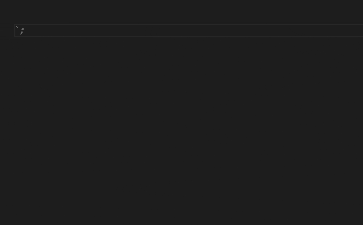

> 代码片段是可以更轻松地输入重复代码模式的模板，例如循环或条件语句

<!-- more -->
## 自定义snippet优势

- 现有插件提供的`snippet`(如：equimper.react-native-react-redux)弊端
  - 学习与记忆成本高
  - 不一定能达到目标效果，如打印log想自定义tag方便过滤,如：`console.log('name====>', name)`
- 便于在任意文件使用，如`markdown`文件中画表格(目前没想到除了自定义代码片段，如何更方便地在这种文件减少重复代码的编辑工作)
## Hello World
### 创建片段

VSCode左上角  
=> code   
=> 首选项   
=> 用户片段   
=> 新建全局代码片段   
=> 命名test   
=> 放开默认demo注释 

或 `cmd + shift + p` => 输入`snippet` => 选择新建全局代码片段文件

### 使用

在ts或js文件中输入log测试效果


## snippet文件字段说明

```json
{
  // key会出现在代码片段提示的后面，也是后面绑定快捷键用的标识
  "Print to console": {
		// 指定可以触发代码片段的文件类型
		"scope": "javascript,typescript",
		// 触发代码片段的字符
		// "prefix": "log",
		"prefix": ["a", "z"], // 多个时的写法
		// 代码片段内容
		"body": [
			"console.log('$1');",
			"$2"
		],
		// 智能提示预览片段时的标题，若没提供则显示上述key
		"description": "Log output to console"
	}
}
```
`scope`支持的语言标识符可点[此处][language_identifiers]查看（如：`typescript`并不支持`tsx`文件，需要填入`typescriptreact`）

### snippet语法

详细语法可见<a href='#参考文档'>参考文档</a>中的[1]、[2]和[官网][official]，记录的比较详细，此处就简述了

- 占位符：`$1`、`$2`、`$0`，点击`Tab`键切换。`$0` 最终光标位置
- 变量([官网列表][variables])：`$name`，如：
  - `$TM_FILENAME`： 当前文档名 
  - `$TM_SELECTED_TEXT`： 当前选定文本或空字符串
- 占位选项，Tab键可跳过： 
  - `${1|Boolean,Number|}` 
  - 只有一个的话写成`${1:foo}`
- 正则替换（[官网示例][transform]）：`${变量名/正则/替换的内容/}`，如：
  - `${TM_FILENAME/(.*)/${1:/upcase}/}` 将文件名替换为大写
  - `${TM_FILENAME/[\\.]/_/}` 将`.`替换成`_`
  - `${TM_FILENAME/(.*)\\..+$/$1/}` 去掉文件拓展名
```
${TM_FILENAME/(.*)\\..+$/$1/}
  |           |         |  |
  |           |         |  |-> 不设置匹配策略
  |           |         |
  |           |         |-> 引用第一个捕获组的内容
  |           |             
  |           |
  |           |-> 匹配拓展名前的内容
  |               
  |
  |-> 变量名--文件名

```

## 快捷键

在`keybindings.json`编辑快捷键片段： 输入 `cmd+k cmd+s`  => 右上角打开文件图标


### 快捷键中直接新建片段

```json
{
  "key": "cmd+k 1",
  "command": "editor.action.insertSnippet",
  "when": "editorTextFocus",
  "args": {
    "snippet": "console.log($1)$0"
  }
}
```

### 引用已有片段

以下示例绑定默认示例中的snippet，输入`cmd+k 2`查看效果

```json
{
  "key": "cmd+k 2",
  "command": "editor.action.insertSnippet",
  "when": "editorTextFocus",
  "args": {
    "langId": "csharp",
    // 对应想绑定的片段的key
    "name": "Print to console"
  }
}

```
## 示例片段

###  TS、RN函数组件

用模版创建一个RN的函数组件，默认取文件名当组件名字

```json
{
  "TS-RN函数组件": {
    "prefix": "itf",
    "scope": "typescriptreact",
    "body": [
      "import React from 'react';",
      "import { View, StyleSheet, StyleProp, ViewStyle } from 'react-native';",
      "",
      "export type ${1:$TM_FILENAME_BASE}Props = {",
      "  style?: StyleProp<ViewStyle>;",
      "  $2",

      "};",
      "",
      "const ${1:$TM_FILENAME_BASE}: React.FC<${1:$TM_FILENAME_BASE}Props> = ({ style, $3 }) => {",
      "  return (",
      "    <View style={[styles.wrapper, StyleSheet.flatten(style)]}>",
      "      $0",
      "    </View>",
      "  );",
      "};",
      "",
      "const styles = StyleSheet.create({",
      "  wrapper: {},",
      "});",
      "",
      "export default ${1:$TM_FILENAME_BASE};",
      ""
    ],
    "description": "TS-RN函数组件"
  }
}

```


### MarkDown中创建表格

特定文件使用的代码片段可通过`code => 首选项 => 用户片段 => 选择特定语言` 的方式创建，便无需填写`scope`

```json
"字符转换表格": {
    "prefix": "/t",
    "body": [
      "${TM_SELECTED_TEXT/(\\S+)\\s+/| $1 /g}|",
      "${TM_SELECTED_TEXT/(\\S+)\\s+/|:--:/g}|",
      "${TM_SELECTED_TEXT/(\\S+)\\s+/|   /g}|"
    ],
    "description": "字符转换成表格，根据空格分割出标题"
  }
```



## 总结

总的来说snippet使用比较简单，提效非常明显且优雅，强烈安利。本文不过拾人牙慧，建议上[官网][official]详细了解下

ps: 片段生成工具：[Snippet生成器](https://snippet-generator.app/)

ps2: 其他VSCode小技巧传送门：[VSCode快捷键推荐](https://juejin.cn/post/7040486849755742244)

## 参考文档

[1] [VSCode 利用 Snippets 设置超实用的代码块](https://juejin.cn/post/6844903869424599053)  
[2] [一个案例学会 VSCode Snippets，极大提高开发效率](https://juejin.cn/post/7052694806685810725)  
[3] [官方文档](https://code.visualstudio.com/docs/editor/userdefinedsnippets)  
[4] [Snippet 生成器](https://snippet-generator.app/)


[variables]:https://code.visualstudio.com/docs/editor/userdefinedsnippets#_variables

[transform]:https://code.visualstudio.com/docs/editor/userdefinedsnippets#_transform-examples

[official]:https://code.visualstudio.com/docs/editor/userdefinedsnippets

[language_identifiers]:https://code.visualstudio.com/docs/languages/identifiers

<!-- ## 随记

markdown prefix /开头才能生效? 

scope 语言标识符可设置哪些，tsx文件如何加 -->
