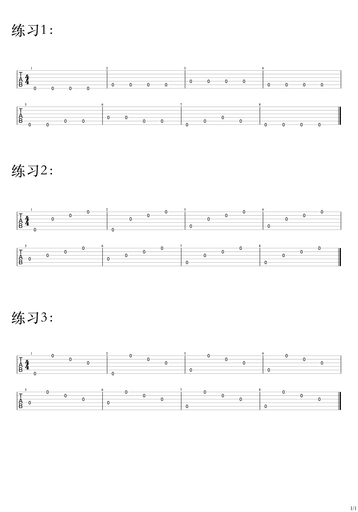
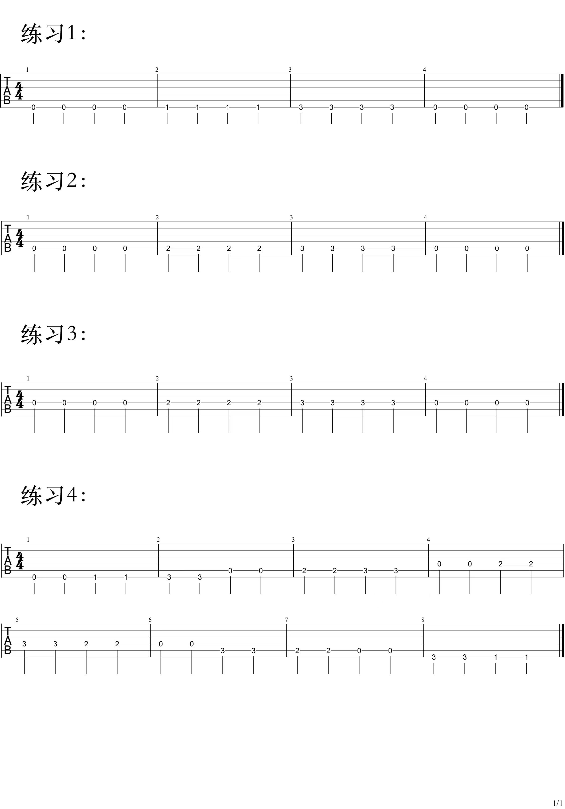
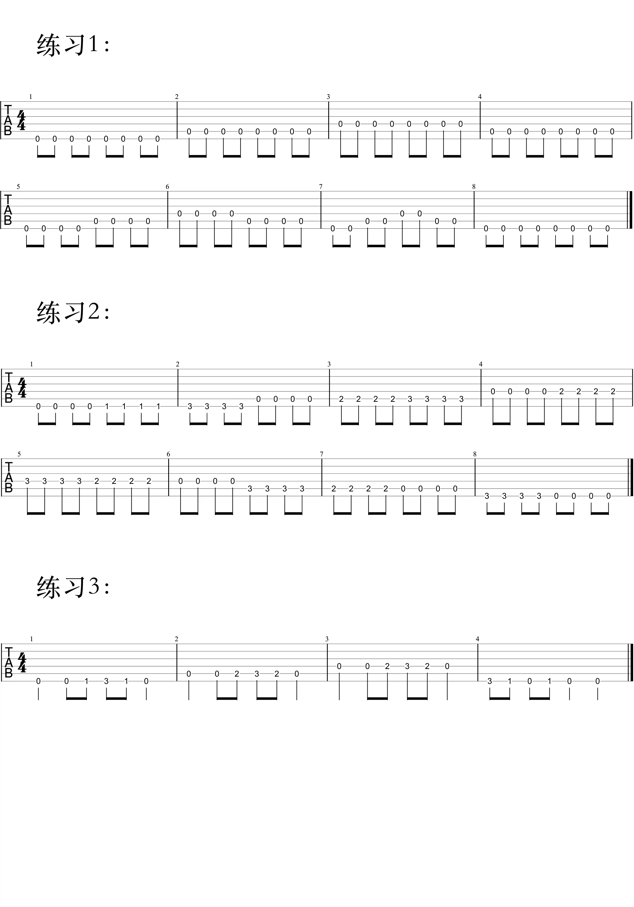
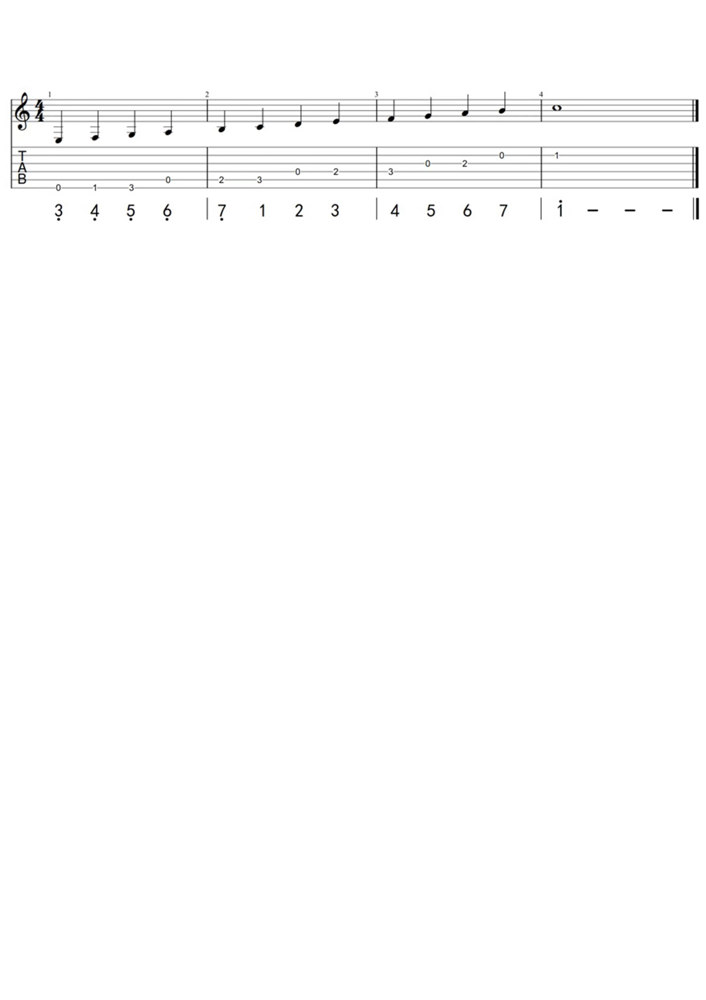
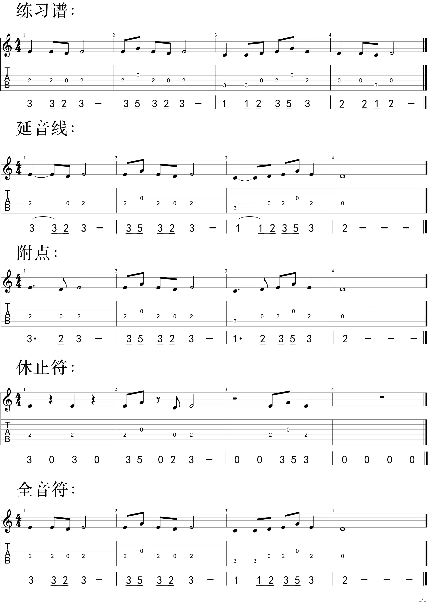
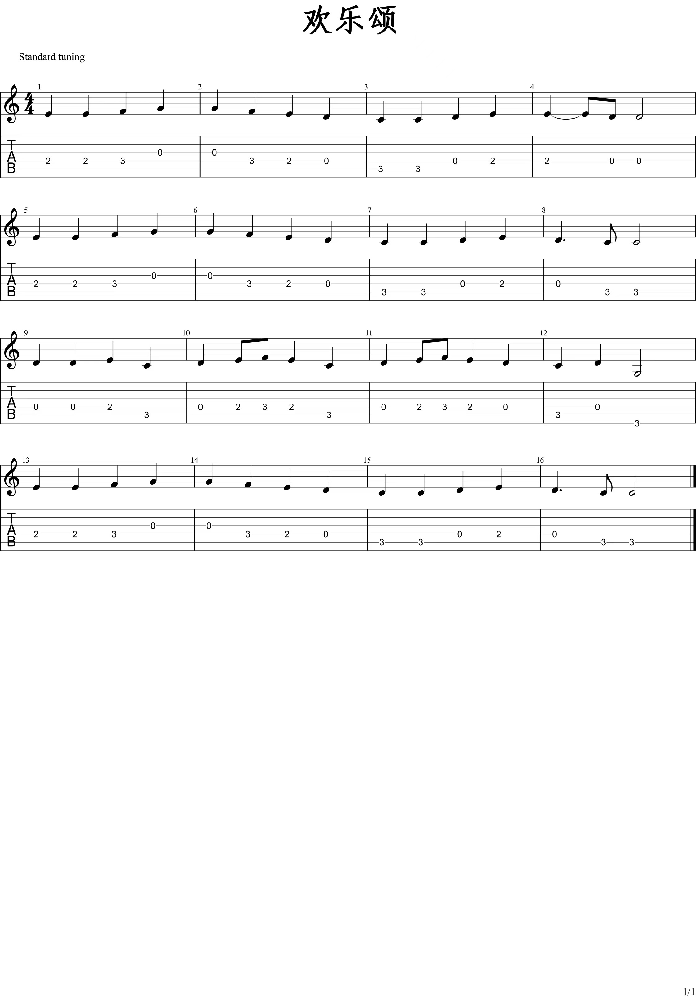

<!-- more -->

## Hello World 

1. [吉他选购](https://www.bilibili.com/video/BV1FB4y1s761) 

my: 卡马 D1C 

2. [调音](https://www.bilibili.com/video/BV1db411c7gQ?p=2)

工具： 调音器 || APP Finger

注意：先松琴弦再调音

3. 抱琴

小凹槽放右侧大腿，右手手肘放琴凸出最高点，琴壁靠胸下方留一点空隙

4. 右手拨弦

各个手指向手心移动

5. 左手按弦

古典手型

民谣手型

> 前期动作可以慢，但是一定要标准，不能养成错误的习惯

## 分音符

4分音符练习：

8分音符练习： 

##  谱子

- 简谱 1234567、高音点、低音点

- 六线谱

- 五线谱： 
  - 5 线 4间 9个音，不够用则上加（一、二）线、下加（一、二）线增加音符，上加间、下加间
  - 低音谱表、高音谱表
  - 下加一线 do, 往上依次 mi sol ti
  - 下加一间 re, 往上依次 re fa la 

5弦三品 do ，依次确认下来 do re ... ti .., 称为c大调音阶

|     简谱      |   1   |   2   |   3   |   4   |   5   |   6   |   7   |   i   |
| :-----------: | :---: | :---: | :---: | :---: | :---: | :---: | :---: | :---: |
| 位置（弦-品） |  5-3  |  4-0  |  4-2  |  4-3  |  3-0  |  3-2  |  2-0  |  2-1  |

常用： 6 线谱 + 简谱、6线谱 + 五线谱，

## 时值

时值：音的长短，4分音符1拍，8分半拍

连音线: 连接两个相同的音，表示第一个的延长，时值等于两个音的总和

附点： 让音符的时值延长一半

休止符： 不发音、单拍子时间要给到位

止音：小指

## 欢乐颂

需要达到看到五线谱能知道该按什么位置

