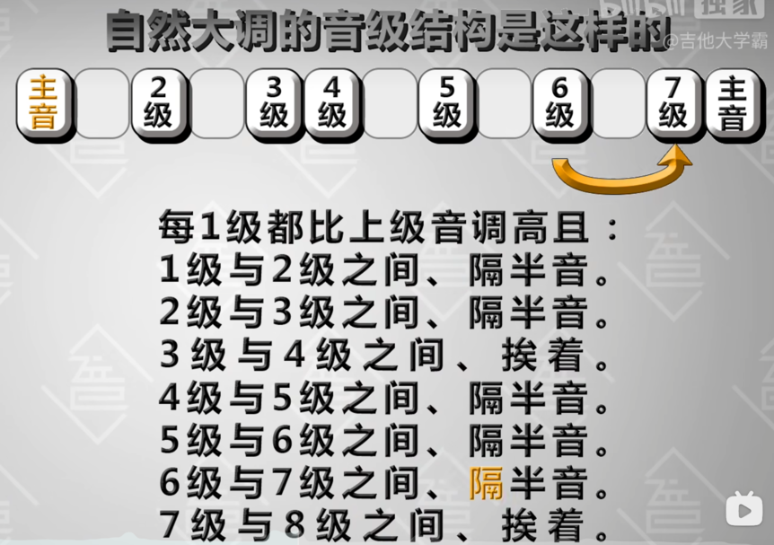
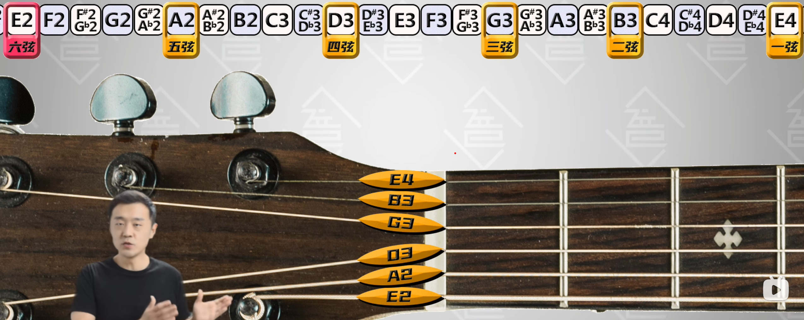

<!-- more -->

# 入门必看防弯路

[入门先看](https://www.bilibili.com/video/BV1rS4y1J7TS)，打卡练习时刻表：

时刻注意：

1. 曲子练习，需要唱简谱
2. 姿势做标准，不能将就，可以慢，不能错
3. 坚持

# 右手基基本功

分级别练习

# [左手基本功](https://www.bilibili.com/video/BV15b4y177PN/?spm_id_from=333.788&vd_source=554c813e9abf3a2eb6e0cf650060074e)

靠弦按弦练习

离弦按弦练习

正向爬格子

反向爬格子

左手出现问题[参考](https://www.bilibili.com/video/BV13Z4y1i7e1?spm_id_from=333.999.0.0&vd_source=554c813e9abf3a2eb6e0cf650060074e)

# 基础乐理

- 咋震动(一秒多少次) 音调
- 震多大 响度
- 啥在震 音色
- 震多久 长短

绝对音高： 以震动频率来命的名字就是绝对音高

| 频率(Hz) | 音名  | 唱名  |
| :------: | :---: | :---: |
|  493.88  |   B   |  si   |
|  440.00  |   A   |  la   |
|  392.00  |   G   |  sol  |
|  349.23  |   F   |  fa   |
|  329.63  |   E   |  mi   |
|  293.66  |   D   |  re   |
|  261.64  |   C   |  do   |

规定频率每翻倍或减半依然叫这个音，为什么呢，因为人耳对音高的感觉主要取决于频率比，而不是频率差，(05:43)一般人认为440hz到880Hz的音差和246.94hz到493.88Hz的音差一样大

> 音高: 在音乐领域里指的是人类心理对音符基频之感受。[1]
> 基频：当发声体由于振动而发出声音时，声音一般可以分解为许多单纯的正弦波，也就是说所有的自然声音基本都是由许多频率不同的正弦波组成的，其中频率最低的正弦波即为基音，而其他频率较高的正弦波则为泛音。[2]
> 音差？没找到详细的名词解释，可参考[相关链接](https://www.zhihu.com/question/307553920)理解下

各个音的绝对准确高度和他们的相互关系，是确定调式和音高的基础

绝对准确高度 = 频率？基频？

他们的相互关系 = 各个音的组合？

> 调式: 若干个以特定顺序连接起来的音以一个主音为中心形成的集合[3]
## 12 平均律

一组有12个间隔均等的音组成的音律叫做12平均律

[看视频吧，更易懂，06：34](https://www.bilibili.com/video/BV1QU4y1R7hg)

每个相邻的音，分成12份，每个相邻的音都是大约1.05946倍，其中有7个是前面讲到的CDEFGAB，剩余5个可以叫升比他高的音或降比它低的音

人类听觉范围20Hz-20000Hz,能听到大概10组音，吉他能演奏的音如下

## 固定调唱名法

固定调唱名法：用分组和字母来代替具体频率命名的方法

## 大调式

自然大调式

命名方式 主音(自然)大调，eg:c大调 

## 首调唱名法

首调唱名法：只称呼音级、序号、不代表具体音的叫法 

# 全指版音阶系统教学

都是标准音时，空弦音1-6弦 分别，E2、A2、D3、G3、B3、E4

品与品的音高关系：约靠近琴头音调约低，每个品格与挨着的品格相差半音

从六弦空弦音开始，顺次往右按住每品弹，到与空弦音重复的品就跳过这一品，去弹下一根弦的空弦音，这不就和12平均律的音列一模一样吗（试着弹一下 ，很神奇）

小公式：

除了2、3弦，高弦n品 = 低弦n品 + 5品

2弦n品 = 3弦n品 + 4品

从任意一品开始都可以弹出一个12平均律音列

把位：指板上某品到某品的区域

## 音阶的弹法咋来的

C大调

弹法见[视频](https://www.bilibili.com/video/BV1X44y1N7x5)
# 参考文献

[1] [维基百科-音高](https://zh.m.wikipedia.org/zh-cn/%E9%9F%B3%E9%AB%98)
[2] [维基百科-基频](https://zh.m.wikipedia.org/zh-cn/%E5%9F%BA%E6%9C%AC%E9%A0%BB%E7%8E%87)
[3] [维基百科-调式](https://zh.wikipedia.org/wiki/%E8%B0%83%E5%BC%8F)
