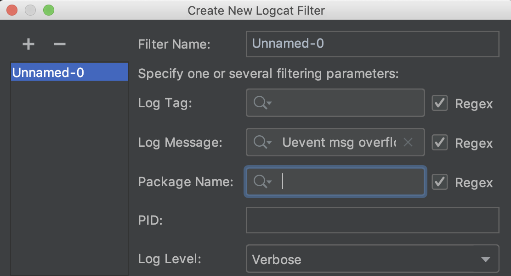

# AS 调试技巧
## 折叠 LOG

### 设置一行显示内容

### 常用搜索条件添加到过滤器

### 折叠近似日志

## 调试已启动应用

## 断点技巧

### 拖动断点进行移动

### 条件断点

右击断点，表达式为 true 时，断点激活

### 依赖断点

依赖断点只会在特定的断点被触发后才会激活

> 一段代码会被不同的路径触发，这种情况在应用开发中并不少见。如果您发现了只会在某个特定路径才会触发的 Bug，随意为其打一个断点会造成许多无意义的运行中断。依赖断点只会在特定的断点被触发后才会激活。举例来说，您可以创建一个只会在您感兴趣的路径中被触发的断点，而其他断点便可以依赖此断点，从而使这些断点也只会在您所感兴趣的路径中被触发。

**右击断点->More->在 Disable until breakpoint is hit**选框中，选中您想要依赖的断点:

现在，您的应用只会在前一个断点被触发后才会在此断点停止运行。

### 断点打印

不用代码 println !!!
断点选项中禁用 **Suspend** 并启用 **Evaluate and log**:

### 禁用断点

快捷键 option+点击断点

### 断点分组

- 分组调试
- 快速删除
  

## 丢弃当前帧

Android 10 或者更高版本，可以通过点击调试工具栏中的 Drop Frame 按钮来进行回溯

把您从当前的方法带回到其开始执行前的节点，从而给您一个重新进入该方法的机会。

## 标记对象

跟踪某特定实例的生命周期  
右键调试窗口对象->**Mark Object**

点击...设置颜色

详见： https://mp.weixin.qq.com/s/vAi1R8hkWqJpwYTHuFkmBw

## 评估表达式

处于某个断点时，可以使用调试工具中的 **Evaluate expression** ,可输入表达式评估对象

分析堆栈信息
崩溃报告中可能包含了异常堆栈信息的文本副本。您可以使用 **Analyze** 菜单中的 **Analyze Stack Trace or Thread Dump** 将这些信息转化为有意义的内容。

点击 **OK** 之后，就会将包含完整注释的堆栈信息添加到控制台:

## 其他

- 在 Debug 模式下，点击代码的行数数字可以直接执行此行代码
- Ctrl + 拖动操作可以复制断点
- 您可以在函数的右括号处设置断点
- 您可以在字段和属性上设置断点，被称为 "field watch points"
- 您可以为接口中的方法设置断点，从而使它的所有实现都会触发断点
- 更详细的见参考资料[3]

## 参考资料

[1] https://mp.weixin.qq.com/s/kZGM2vgSmxdyTKPqm1J3XA  
[2] https://mp.weixin.qq.com/s/vAi1R8hkWqJpwYTHuFkmBw  
[3] https://developer.android.google.cn/studio/debug  
